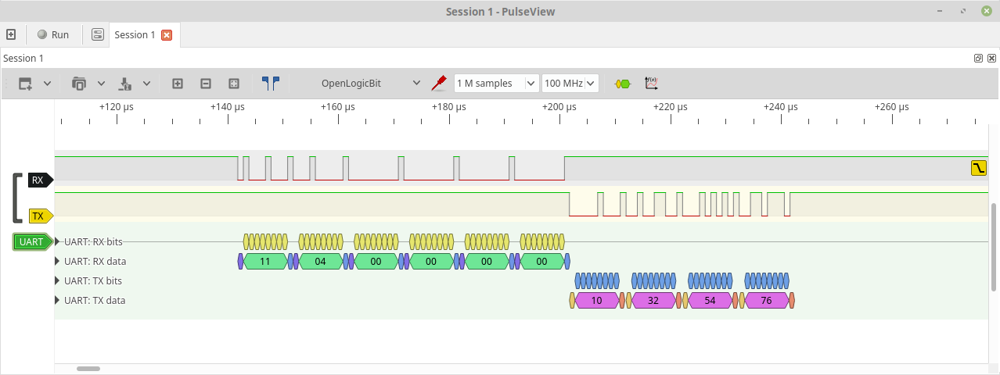
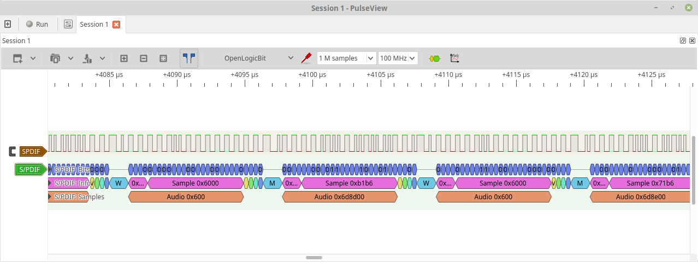
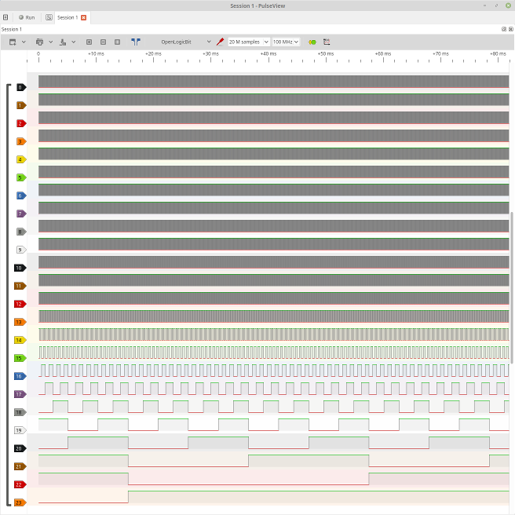

# open-logic-bit
*Open-source Logic Analyzer gateware for various FPGA dev boards/replacement gateware for commercially available logic analyzers.*

Github: [https://github.com/ultraembedded/openlogicbit](https://github.com/ultraembedded/openlogicbit)

## Aims
A logic analyzer project which aims to provide reliable, high speed (100MHz+), large capture depth, open-source gateware that can be used on a FPGA development board you already own, or as replacement gateware for commercial logic analysers that do not work with open-source tools such as [sigrok](https://sigrok.org/).

This project aims to support FPGA boards with 10's MBs of capture memory (such as DDR3), which also have high-speed USB interfaces from which to download the captured data.

There are a number of other open-source logic analyzer projects, but these mostly focus on using limited internal FPGA memories (embedded block RAMs), and low-performance host interfaces (UART).

## Features
* 16, 24, 32 input channels supported.
* Run-length encoded (RLE) compression to extend the sample buffer depth.
* Support for boards with large memories (DDR, SDRAM).
* Up to 32 triggers supporting edge, level, value match modes.
* Support for boards with FTDI sync FIFO mode support (FT232H, FT2232H).
* Support for external clock sources.
* Continuous or one-shot capture modes.
* libsigrok support available (enabling support for Sigrok, Pulseview).

*A screenshot of Sigrok capturing a SPDIF signal at 100MHz with open-logic-bit running on a Digilent Digital Discovery;*

## Supported Boards
* [Digilent Digital Discovery](https://reference.digilentinc.com/test-and-measurement/digital-discovery/start)
* More to come...

## Software
Compatible with Sigrok (via libsigrok), based on the following fork;
* [https://github.com/ultraembedded/libsigrok](https://github.com/ultraembedded/libsigrok)

*open-logic-bit also contains a built in test mode;*

